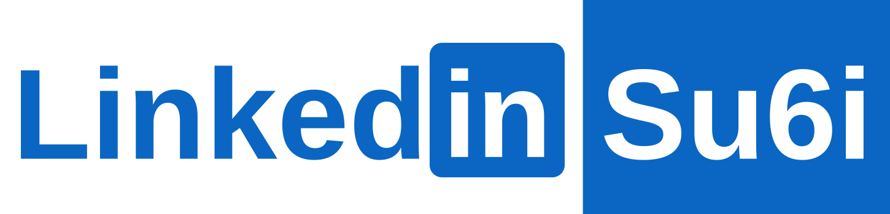
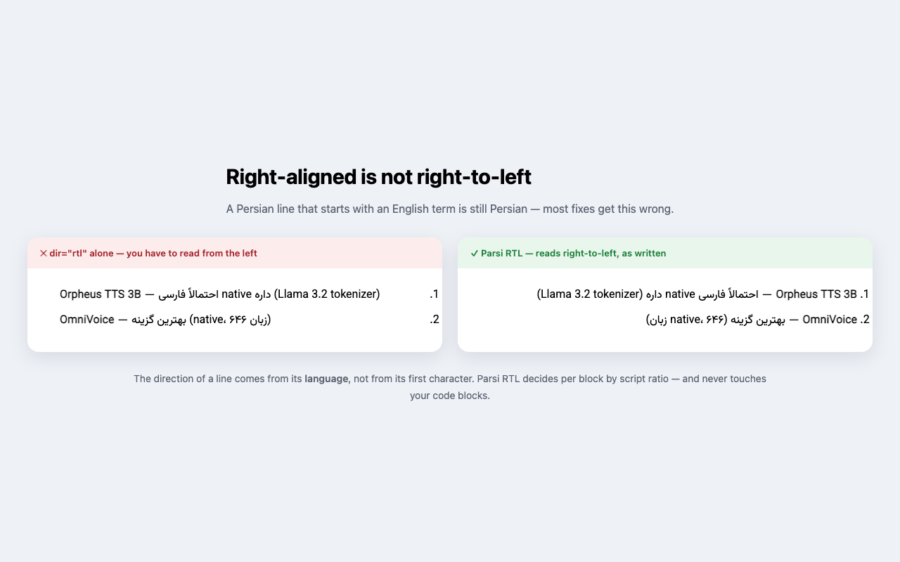
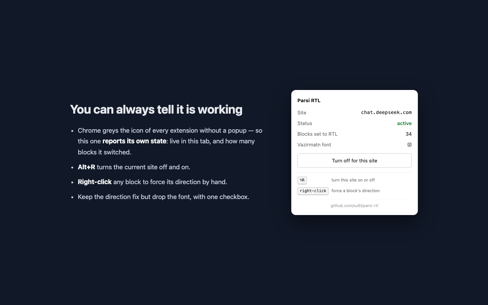

<div align="center">


<h1>Parsi RTL ↔</h1>

<p align="center" dir="ltr">
  <a href="https://github.com/su6i/parsi-rtl/releases"></a>
  <a href="../../LICENSE"></a>
  <a href="../ARCHITECTURE.md"></a>
  <a href="#-مرورگرها"></a>
  <a href="../../PRIVACY.md"></a>
  <a href="https://linkedin.com/in/su6i"></a>
</p>

<strong>راست‌چین‌بودن با راست‌به‌چپ‌بودن یکی نیست.</strong><br>
<sub>جهتِ هر بلاک از زبانِ همان بلاک تصمیم گرفته می‌شود، نه از اولین کاراکترش.</sub>

[🇬🇧 English](../../README.md) • [معماری](../ARCHITECTURE.md) • [تغییرات](../../CHANGELOG.md) • [حریم خصوصی](../../PRIVACY.md)

</div>

---

## 🏗 مسئله

راه‌حلِ رایجِ یک‌خطی برای متنِ راست‌به‌چپ، یعنی `unicode-bidi: plaintext`، قانونِ
**first-strong** یونیکد را اعمال می‌کند: جهتِ پاراگراف از اولین کاراکترِ
جهت‌دارش گرفته می‌شود. این دقیقاً برای رایج‌ترین شکلِ جملهٔ فارسی غلط است — جمله‌ای
که با یک اصطلاحِ فنیِ انگلیسی شروع می‌شود:

```text
Gemini web app رو Google سرو می‌کند (تو نمی‌تونی local app رو modify کنی)
```

الگوریتم حرفِ `G` را می‌بیند، کلِ خط را چپ‌به‌راست می‌چیند، و پرانتزِ پایانی و
ترتیبِ عبارت‌ها به‌هم می‌ریزد. نتیجه این است که یک جملهٔ فارسی را از سرِ اشتباه
می‌خوانی.

<div align="center">
  
</div>

## ⚡ راه‌حل

**جهتِ یک خط، خاصیتِ زبانِ آن است، نه اولین کاراکترش.** این اکستنشن برای هر بلاک
حروف را بر اساسِ خط (script) می‌شمارد: جملهٔ فارسی که اصطلاحاتِ انگلیسی دارد
راست‌به‌چپ می‌ماند، و جملهٔ انگلیسی که یک واژهٔ فارسی دارد چپ‌به‌راست. تصمیم به‌صورتِ
صفتِ واقعیِ `dir` روی خودِ المان نوشته می‌شود، پس حرکتِ مکان‌نما، انتخابِ متن و
آینه‌شدنِ علائم هم درست کار می‌کنند — چیزهایی که فیکسِ صرفاً CSS به آن‌ها دست
نمی‌رسد.

| | |
| --- | --- |
| **همهٔ خط‌های راست‌به‌چپ** | عربی (فارسی، اردو، پشتو، کردی، سندی)، عبری، سریانی، ثانا، نکو، آدلام، سامری، مندایی |
| **همهٔ سایت‌ها** | چت‌های هوش مصنوعی، انجمن‌ها، مستندات، وب‌میل — جایی که متنِ RTL نباشد کاری نمی‌کند |
| **سازگار با استریم** | جوابِ مدل‌ها توکن‌به‌توکن می‌آید؛ ناظرِ بسته‌بندی‌شده در یک فریم همراهش می‌ماند بدونِ کندیِ هر-توکن |
| **کد چپ‌به‌راست می‌ماند** | `pre`، `code`، `kbd`، `samp` — حتی کدِ درون‌خطی داخلِ جملهٔ فارسی. ولی جدولِ فارسی فارسی است و از بلاکِ خودش پیروی می‌کند |
| **کادرِ تایپ** | جهتِ ورودی هم‌زمان با تایپِ تو به‌روز می‌شود، و کادری که خودِ سایت تنظیمش کرده دست‌نخورده می‌ماند |
| **خاموشی بدونِ reload** | کلیدِ هر-سایت در جا اثر می‌کند، پس پرامپتِ نیمه‌تایپ‌شده‌ات از بین نمی‌رود |
| **وزیرمتن، جاسازی‌شده** | فقط روی بلاک‌های RTL و با گاردِ `unicode-range`، پس فونتِ آیکن‌ها سالم می‌ماند |
| **هیچ داده‌ای جمع نمی‌شود** | بدونِ درخواستِ شبکه، بدونِ آنالیتیکس، بدونِ حساب کاربری |

## 🚀 نصب

### از فروشگاه — یک کلیک، با به‌روزرسانیِ خودکار

<!-- ACTION: بعد از تأییدِ هر بازبینی، لینکِ واقعیِ همان فروشگاه اینجا جایگزین شود -->
- **Chrome Web Store** — *در انتظارِ بازبینی*. همین صفحه روی Brave، Edge، Arc،
  Opera و Comet هم نصب می‌شود.
- **Firefox Add-ons (AMO)** — *در انتظارِ بازبینی*.

### مستقیم از همین مخزن — دستی، بدونِ نیاز به حسابِ فروشگاه

اگر می‌خواهی همین امروز اجرایش کنی، یا نسخهٔ تغییرداده‌شدهٔ خودت را اجرا کنی، این
مسیر است.

<div dir="ltr">

```bash
git clone https://github.com/su6i/parsi-rtl.git
```

</div>

*(یا در گیت‌هاب **Code → Download ZIP** و بعد از حالتِ فشرده خارجش کن — پوشه‌ای که
به مرورگر می‌دهی باید همان پوشه‌ای باشد که `manifest.json` داخلش است.)*

**کروم، Brave، Edge، Arc، Opera، Comet**

۱. آدرسِ `chrome://extensions` را باز کن (در Edge: `edge://extensions`، در Brave: `brave://extensions`).
۲. **Developer mode** را از بالا-راست روشن کن.
۳. روی **Load unpacked** بزن و پوشهٔ clone‌شده را انتخاب کن.
۴. هر تبی که از قبل باز بوده را reload کن: content script فقط موقعِ لودِ صفحه تزریق می‌شود.

**فایرفاکس**

۱. آدرسِ `about:debugging#/runtime/this-firefox` را باز کن.
۲. روی **Load Temporary Add-on…** بزن و فایلِ `manifest.json` داخلِ پوشه را انتخاب کن.
۳. تب‌ها را reload کن. افزونهٔ موقت با بسته‌شدنِ فایرفاکس پاک می‌شود — برای ماندگاری،
   بعد از تأییدِ بازبینی از AMO نصبش کن.

نسخهٔ دستی خودکار به‌روز نمی‌شود: `git pull` بزن و روی کارتِ اکستنشن دکمهٔ ↻ را فشار بده.

کروم هشدار می‌دهد که اکستنشن می‌تواند «داده‌های همهٔ سایت‌ها را بخواند و تغییر
دهد». معنیِ اجرا روی همهٔ سایت‌ها همین است؛ کد فقط متن را می‌خواند و صفتِ `dir`
می‌نویسد، هیچ درخواستِ شبکه‌ای ندارد و جز فهرستِ سایت‌های خاموش چیزی ذخیره نمی‌کند.

## 🎛 کنترل‌ها

| کنترل | کارش |
| --- | --- |
| **پاپ‌آپ** (کلیک روی آیکن) | سایتِ فعلی، زنده‌بودنِ اسکریپت در این تب، تعداد بلاک‌های راست‌به‌چپ‌شده، روشن/خاموشِ فونت، سوییچِ خاموشِ همین سایت |
| **`Alt+R`** (روی مک **`⌥R`**) | خاموش/روشن کردنِ همین سایت بدونِ باز کردنِ پاپ‌آپ — تغییرِ کلید در `chrome://extensions/shortcuts` |
| **راست‌کلیک روی یک بلاک** | اجبار به راست‌به‌چپ / چپ‌به‌راست یا پاک‌کردنِ اجبار؛ پاسِ خودکار هرگز تصمیمِ دستی را بازنویسی نمی‌کند |
| **تیکِ فونت** | جهت اصلاح شود ولی تایپوگرافیِ خودِ سایت دست‌نخورده بماند |

### آیکن خاکستری است — یعنی خراب است؟

نه. کروم آیکنِ هر اکستنشنی را که کارش کاملاً در content script انجام می‌شود
خاکستری نشان می‌دهد. چون این باعث می‌شود «در حالِ کار» و «بی‌صدا خراب» یکسان به
نظر برسند، پاپ‌آپ وضعیت و تعدادِ بلاک‌های تغییریافته را نشان می‌دهد — عددِ بالای
صفر یعنی دارد کار می‌کند.

دو چیز واقعاً غیرفعالش می‌کند: تبی که **قبل از** نصب یا reload ِ اکستنشن باز شده
(تب را reload کن)، و سایتی که خودت خاموشش کرده‌ای.

<div align="center">
  
</div>

## 🌐 مرورگرها

| مرورگر | روش |
| --- | --- |
| کروم | Chrome Web Store یا نصبِ دستی |
| Brave، Edge، Arc، Opera، Comet | همان بستهٔ کروم را مستقیم نصب می‌کنند — بدونِ ارسالِ جداگانه |
| فایرفاکس ۱۴۰ به بالا (اندروید ۱۴۲ به بالا) | بستهٔ خودش، ساخته‌شده از همان سورس — فایرفاکس در MV3 service worker ندارد، پس در مانیفستش `background.scripts` می‌نشیند به‌جای `background.service_worker` ِ کروم |

## 🧪 تست‌ها

<div dir="ltr">

```bash
npm test               # الگوریتم جهت (۱۲ مورد) + ساختِ مانیفست
npm run render:fixture # test/visual/cascade.png — کَسکِیدِ CSS
```

</div>

`npm test` رفتارِ الگوریتم را قفل می‌کند، از جمله همان جملهٔ بالا و هر دو طرفِ
مرزِ نسبت، و بررسی می‌کند که مانیفستِ کروم و فایرفاکس هنوز فقط در یک کلید فرق
داشته باشند.

فیکسچر چیزی را پوشش می‌دهد که تستِ واحد نمی‌تواند: **کَسکِید**. گذاشتنِ `dir="rtl"`
به‌تنهایی کافی نیست وقتی سبکِ خودِ سایت روی `<p>` ِ داخلی `unicode-bidi: plaintext`
دارد — آن وقت بلاک راست‌چین به نظر می‌رسد ولی ترتیبِ ران‌ها هنوز چپ‌به‌راست است،
یعنی همان باگِ اصلی که یک لایه پایین‌تر پنهان شده. پنلِ **A** باگ است، **B** فیکس،
و **C** نگهبانِ بلاک‌های کد.

## 🔧 تنظیم

هر چیزی که ارزشِ دست‌کاری دارد بالای [`src/rtl.js`](../../src/rtl.js) است:
`RTL_RATIO` (چقدر خطِ راست‌به‌چپ کافی است)، `MIN_STRONG_CHARS`،
`BLOCK_SELECTOR` و `SKIP_CLOSEST`. برای اینکه اجزا چطور کنارِ هم می‌نشینند و
چطور گسترش‌شان بدهی، [docs/ARCHITECTURE.md](../ARCHITECTURE.md) را ببین.

## 📄 پروانه

MIT — فایلِ [LICENSE](../../LICENSE).

وزیرمتن ۵.۳.۰ از صابر راستی‌کردار، با پروانهٔ SIL Open Font License 1.1؛ متنِ
پروانه در [`src/fonts/LICENSE-Vazirmatn.txt`](../../src/fonts/LICENSE-Vazirmatn.txt)
همراهِ بسته است.

## 🔗 مرتبط

برای اپ‌های دسکتاپِ **Electron** (کلود دسکتاپ، VS Code، Obsidian) مسیرِ معادل،
پچ‌کردنِ `app.asar` است — راهنمای
[`rtl-persian-app-patching`](https://github.com/su6i/agent-constitution/blob/main/skills/rtl-persian-app-patching.md).
اپ‌های نیتیو
(ChatGPT و Gemini ِ مک) اصلاً سطحی برای تزریق ندارند؛ آنجا تنها اهرم، مرورگر است.
